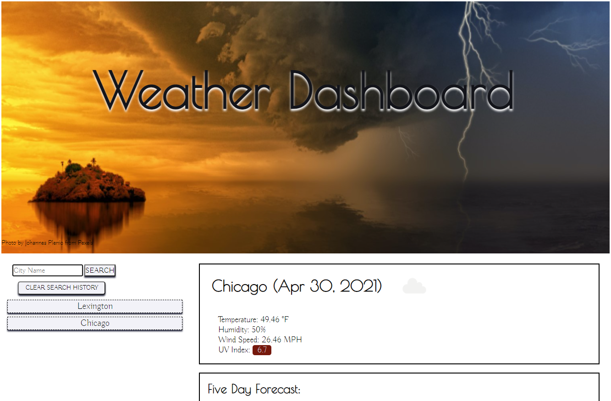
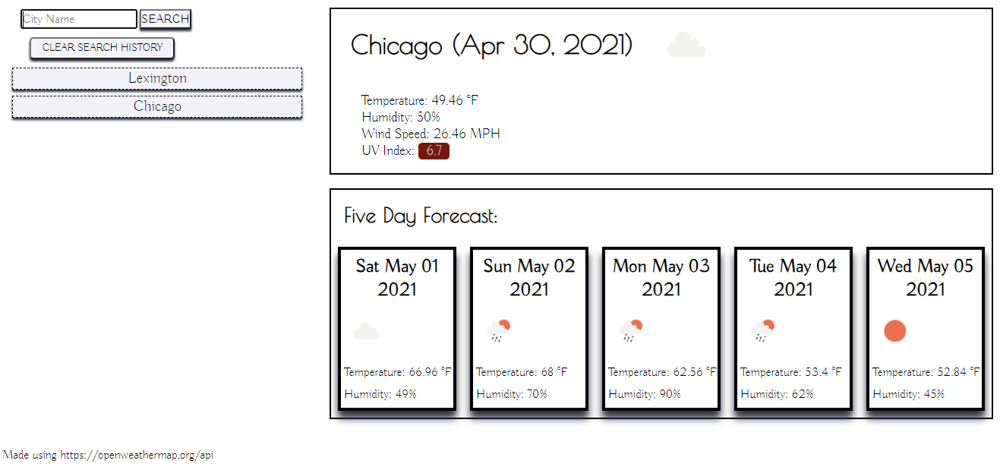
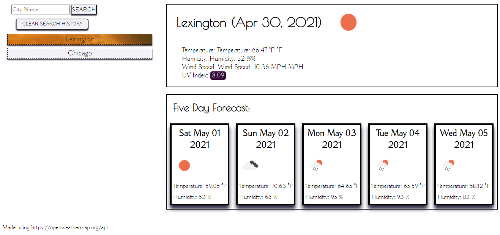

# WeatherPlanner
## Description:
This application is designed to pull current weather data for the city that was searched, as well as a five day forecast for that city. The searched city is saved as a button, and can be clicked on later to recall that city's weather data from the user's local storage. A clear button was added to clear out the search history. This application uses the open weather api, so I learned how to apply api calls to code functions, and how to use the data given in an api call to pull out what was needed for the application.

## Usage
To get your weather data, type in the name of the city you would like to search. The current day's data will populate, along with an icon showing you if the day is clear, cloudy, storming, etc. A five day forecast will also populate so you can get a quick snapshot of what the next five days will look like for planning out your week!
The searched city will save to the page, so as you search other cities, just click on previous searches to pull that data back up. Clear out your search history with the clear button. Happy weather planning!

Dashboard:

Clicking on a previously saved city:

Link: https://aanolan51.github.io/WeatherPlanner/

## Credits:
1. Photo Credit: https://www.pexels.com/photo/island-during-golden-hour-and-upcoming-storm-1118873/
2. https://bithacker.dev/fetch-weather-openweathermap-api-javascript
3. https://softauthor.com/javascript-for-loop-click-event-issues-solutions/
4. https://coderrocketfuel.com/article/convert-a-unix-timestamp-to-a-date-in-vanilla-javascript
5. https://openweathermap.org/faq
6. https://www.kirupa.com/html5/handling_events_for_many_elements.htm
7. https://www.epa.gov/sunsafety/uv-index-scale-0